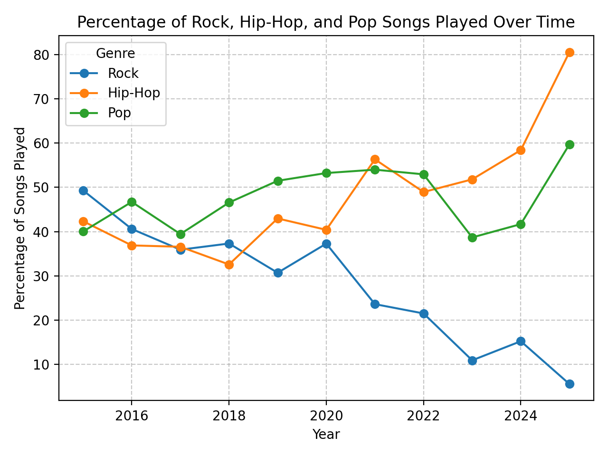

# Personal Spotify Statistics

I like statistics and listening to music, and I also enjoy the yearly Spotify Wrapped. After watching one at the end of each year, I am always interested in more in-depth statistics over multiple years. That's why I created a [website](https://piebro.github.io/spotify-statistics) and a Python script to generate personal Spotify usage statistics.


This works well because, a few years ago, the EU passed the [GDPR Act](https://www.wired.co.uk/article/what-is-gdpr-uk-eu-legislation-compliance-summary-fines-2018), which enables EU citizens to access all personal data a company has stored about you. Spotify stores a log of your listening history, including partial listens. This data log is a treasure if you are interested in your own listening behavior. You can request your `Extended streaming history` data at https://www.spotify.com/us/account/privacy/.

The website automatically generates many different statistics from your listening history data. The data is only processed in your browser and never leaves your computer.

More advanced and custom statistics can be generated using the Python scripts. The data is enriched with Wikidata and the Spotify API, for example genre of artists, album publishing year or artist popularity.



## Creating custom statistics

### Setup Access to the Spotify API

1. Go to `https://developer.spotify.com/dashboard/applications`
2. Click "Create an app"
3. Enter a name and description
4. Click "Create"
5. Click "Edit settings"
6. Click "Add new redirect URI" and enter `http://localhost:8888/callback`
7. Click "Save"
8. Copy the client ID and client secret
9. Create a `.env` file with the following variables:
    ```bash
    SPOTIFY_CLIENT_ID=<spotify-client-id>
    SPOTIFY_CLIENT_SECRET=<spotify-client-secret>
    ```
10. Run `uv run src/add_refeshtoken_to_env.py` to add the Spotify refresh token to the `.env` file

### Create the database

```bash
uv run src/create_db.py "Path-To-Spotify-Extended-Streaming-History-Folder"
uv run src/enrich_with_internet_data.py
```

### Create the statistics

The easiest way to get started is to use the `getting-started.ipynb` notebook.
The documentation of the database and a lot of query examples are in `db_documentation.md`.

It also works quite well to generate new queries using Chat-Bots.
You can paste the `db_documentation.md` file and ask the bot to generate a query for a specific question or idea.

## Some thoughts about the data

I downloaded my own data several times over the past few months without any issues. However, the last time I downloaded it, there was some missing data for the year 2017. For this time period, the reason_end data field consistently showed none instead of the actual reason why the song ended. If you notice anything unusual in your statistics, it might be because the Spotify data export was inaccurate, and I would recommend re-downloading your data.

The data is divided into multiple JSON files, each approximately 10.5MB in size, containing the streaming history. This JSON is comprised of a lengthy list of objects, each representing a listening log. Additionally, there's a PDF file that offers explanations for each data field in various languages. Some preprocessing is performed to work with the data more easily.

I initially used the `ts` (timestamp) as my standard time reference, but I noticed that there were instances where multiple songs were logged at the exact same time. I suspect this might have occurred due to a lack of internet connection at those moments. That's why I looked at the `offline_timestamp`. The time in this field is saved as a [Unix timestamp](https://www.unixtimestamp.com/). However, some entries in this field don't make sense (they were less than 100 and would be from the 1970s). To address this, I utilize the `offline_timestamp` if it seems plausible; otherwise, I revert to using the normal `ts` for the timestamp.

## Similar Projects

- [Awesome Spotify Stats](https://github.com/rimsiw/awesome-spotify-stats/blob/main/README.md)
- [Analyzing Spotify stream history](https://ericchiang.github.io/post/spotify/)
- [Should have been listening to Phoebe Bridgers](https://www.darrenshaw.org/blog/2023/01/05/should-have-been-listening-to-phoebe-bridgers.html)
- [Your Spotify](https://github.com/Yooooomi/your_spotify)

## Contributing

Contributions to this project are welcome. Feel free to report bugs, suggest ideas or create merge requests.

## Developing

### Update the website data

[uv](https://docs.astral.sh/uv/getting-started/installation/) is used in the project to run Python.

```bash
# Use the script to update the data in the folder website/assets
uv run website/data_crunching.py "Path-To-Spotify-Extended-Streaming-History-Folder"

# Run a simple Python server to view your stats in the browser
uv run -m http.server

# Open http://0.0.0.0:8000/ in your browser
```

### Formatting and linting

The project uses the Python code formatter and linter [Ruff](https://github.com/astral-sh/ruff) for python.

```bash
uv run ruff check src/*.py --fix
uv run ruff format src/*.py
```

[Prettier](https://prettier.io/playground/) is used for linting the `website/index.js` file with a `print-width` of 120, `tab-width` of 4, and using single quotes. Additionally, I used [Stylelint](https://stylelint.io/demo/) for linting the `website/index.css` file.


## Website Statistics

There is lightweight tracking for the website using Plausible. Anyone interested can view these statistics at https://plausible.io/piebro.github.io%2Fspotify-statistics. Note that only users without an AdBlocker are counted, so these statistics underestimate the actual number of visitors. I would assume that a significant number of people visiting the site, including myself, have an AdBlocker enabled.

## License

This project is licensed under the MIT License - see the [LICENSE](LICENSE) file for details.